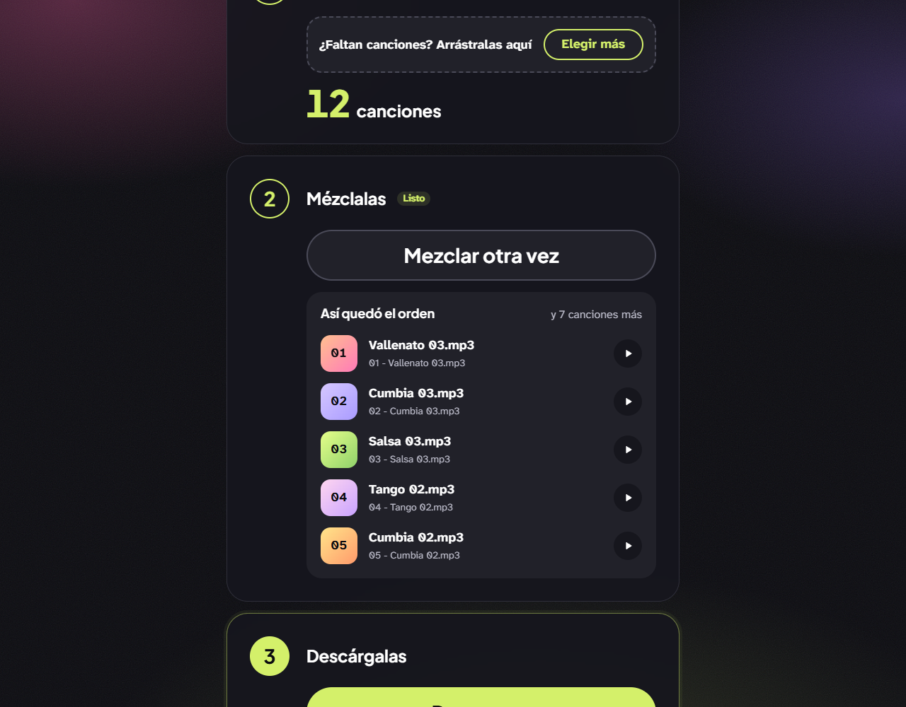
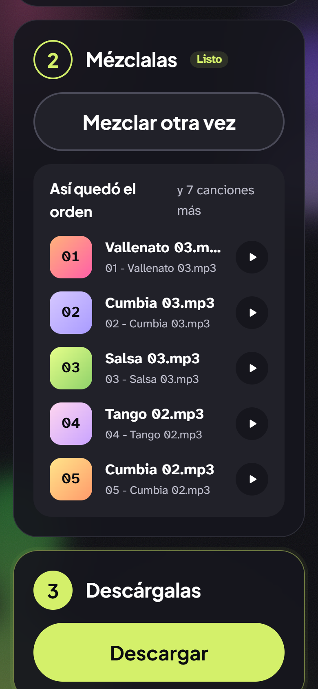

# Mezclador de Música

Renames a folder of songs with random leading numbers and returns them as a ZIP, so a car stereo that plays in filename order stops grouping every genre together.

[](https://mezcladordemusica.wib.digital)
[](https://www.fiverr.com/pablonietop)
[](https://nextjs.org)

<p align="center">
  
  &nbsp;
  
</p>

> **En español:** arrastra tus canciones, toca **MEZCLAR** y descarga un ZIP con los archivos renombrados
> `001 - `, `002 - `… en orden aleatorio. Al copiarlos a la USB, el radio del carro los toca mezclados en vez
> de agrupados por género. Todo corre en el navegador: las canciones no salen de tu computador.

## Description

A car stereo reading songs off a USB stick sorts them by filename. If the music is organised in folders by genre — vallenato, tango, salsa, cumbia — the stereo plays forty vallenatos, then forty tangos. There is no shuffle button on the unit, and the owner is not going to rename four hundred files by hand.

This app does the renaming. Drop the songs in, and it assigns each one a random position and prefixes the filename with a zero-padded number: `001 - `, `002 - `, and so on. Copy the result back to the USB stick and the stereo's alphabetical order becomes the shuffled order.

A browser cannot rename files in place on a USB drive, so the app returns renamed copies inside a ZIP rather than modifying the originals. Nothing is uploaded: the files are read, renamed and zipped entirely in the browser. There is no backend, no database and no account.

## Features

- Drag and drop, or pick files through the system dialog.
- Accepts `.mp3` and `.m4a`, checked by MIME type first and file extension as a fallback. Anything else is ignored silently.
- Duplicate filenames are skipped, so dropping the same batch twice does not double it.
- Fisher-Yates shuffle, with the number width derived from the total — 400 songs produce `001`, not `1`.
- Live progress percentage while the archive is built, from JSZip's progress callback.
- Everything runs client-side; no file leaves the machine.
- Spanish interface built for a non-technical user: 72px buttons, 18px base type, and no text below a 7:1 contrast ratio.

## Tech stack

| Layer | Technology | Version | Role in project |
|---|---|---|---|
| Framework | Next.js | 15.5.18 | App Router, one static page |
| UI library | React | 18.3.1 | Component state |
| Archiving | JSZip | 3.10.1 | Builds the ZIP in the browser |
| Styling | Plain CSS | — | Custom properties, no framework |
| Icons | Inline SVG | — | Hand-written components, no icon dependency |
| Language | JavaScript | — | No TypeScript in this project |

Three runtime dependencies in total. Fonts are the system stack, so the page makes no third-party requests at all.

## Prerequisites

- Node.js 20 or newer
- npm 10 or newer

## Installation

```bash
git clone https://github.com/pabloWIB/Music-Shuffler-App.git
cd Music-Shuffler-App
npm install
npm run dev
```

Open `http://localhost:3000`.

## Usage

1. Drag the songs onto the drop zone, or click it to open the file picker.
2. Press **MEZCLAR** to shuffle and renumber.
3. Press **DESCARGAR** to get `musica-mezclada.zip`, then copy its contents to the USB stick.

The renaming rule lives in `lib/audio.js`:

```javascript
export function buildMixedName(index, total, originalName) {
  const width = String(total).length;
  const position = String(index + 1).padStart(width, "0");
  return `${position} - ${originalName}`;
}
```

With 120 files, `La Gota Fría.mp3` in position 7 comes out as:

```
007 - La Gota Fría.mp3
```

The archive is written with `compression: "STORE"`. MP3 and M4A are already compressed, so deflating them costs CPU and saves nothing.

## Project structure

```
app/
├── layout.js            # Root layout, <head> metadata, CSS imports
├── page.js              # Server Component: header, mixer, footer
├── not-found.js         # 404 page with a link back home
├── manifest.js          # PWA manifest  -> /manifest.webmanifest
├── robots.js            # -> /robots.txt
├── sitemap.js           # -> /sitemap.xml
├── opengraph-image.js   # Renders a real 1200x630 PNG at build time
├── favicon.ico          # 48x48
├── icon.png             # 96x96
└── apple-icon.png       # 180x180
components/
├── music-mixer.js       # Client Component: all the state lives here
├── drop-zone.js         # <label> over a hidden file input
└── icons.js             # Seven inline SVG icons
lib/
├── audio.js             # File-type detection and the renaming rule
├── shuffle.js           # Fisher-Yates
├── zip.js               # Archive building and blob download
└── site.js              # Name, URL, description, brand colours
styles/
├── base.css             # Custom properties, reset, base typography
├── layout.css           # Page shell: header, main, card, footer
└── components.css       # Dropzone, counter, buttons, alerts, progress
public/
├── icon-192.png         # PWA icon
└── icon-512.png         # PWA icon
docs/
├── auditoria.md         # Pre-reorganisation audit
├── cambios.md           # Change log for the reorganisation
└── requisitos.md        # Original build specification
next.config.js
```

## Scripts

| Command | Description |
|---|---|
| `npm run dev` | Dev server on `http://localhost:3000` |
| `npm run build` | Production build |
| `npm start` | Serves the production build |

## Accessibility

The end user is elderly, Spanish-speaking and has reduced vision, so the spec in `docs/requisitos.md` sets a 7:1 contrast target — one level above WCAG AA.

- Every text colour measured against its rendered background clears 7:1 (4.5:1 for large text). The lowest measured value is 7.62:1.
- The drop zone is a `<label>` over a focusable file input, so click, Enter and Space all work without custom key handling.
- Primary buttons are 72px tall; every other interactive target is at least 44×44px.
- The song counter and both alerts are live regions, so a screen reader announces the count, the success message and any error.
- Verified with no horizontal scroll at 360, 480, 768, 1024 and 1440px.

## Deployment

Deployed on Vercel at [mezcladordemusica.wib.digital](https://mezcladordemusica.wib.digital). No environment variables, no backend, no build-time configuration — `git push` triggers the deploy.

## Contributing

Ideas and pull requests are welcome, in English or Spanish. Issues labelled
[`good first issue`](https://github.com/pabloWIB/Music-Shuffler-App/labels/good%20first%20issue) are small and
self-contained. Keep the spirit of the app: no backend, no account, nothing uploaded, and a UI that an
elderly, non-technical user can read.

## License

[MIT](LICENSE) © 2026 Pablo Nieto Pérez

## Author

**Pablo Nieto Pérez** — [wib.digital](https://wib.digital)
GitHub: [@pabloWIB](https://github.com/pabloWIB)

## Hire me

I build **custom internal tools, CRMs and dashboards** for small teams, and
**conversion-focused websites** for businesses.

- [Custom internal tool, CRM or dashboard](https://www.fiverr.com/pablonietop/build-a-custom-internal-app-for-your-business) — from $45
- [Conversion-focused website](https://www.fiverr.com/pablonietop/convert-your-landing-page-design-to-code) — from $80
- [All my services on Fiverr](https://www.fiverr.com/pablonietop)
- [wib.digital](https://wib.digital)
